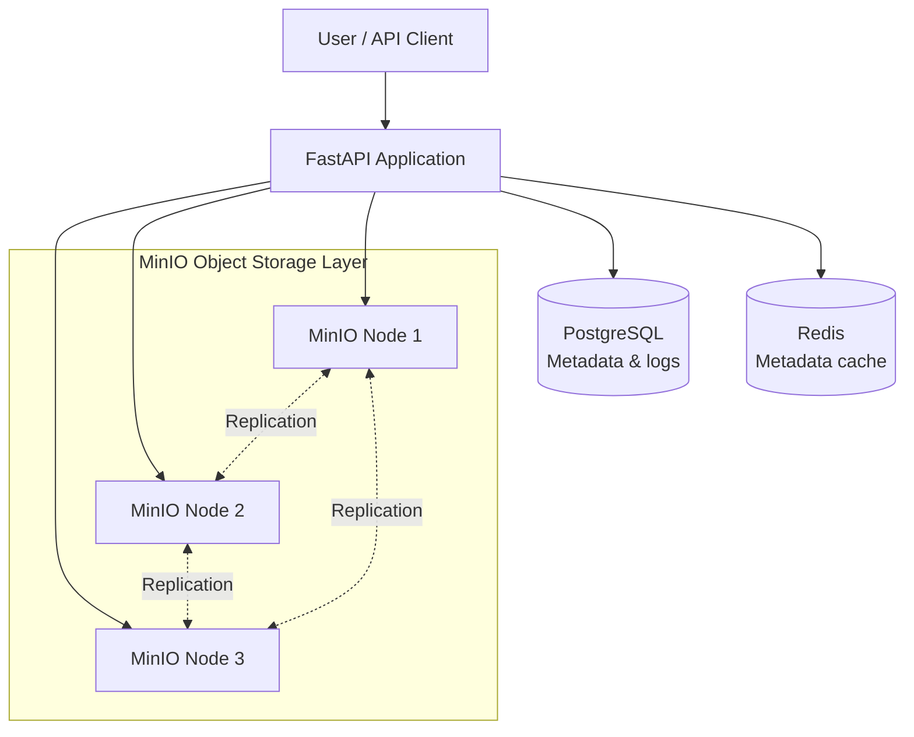

# Distributed File Storage System (DFS)

A fault-tolerant distributed file storage project built with **FastAPI**, **MinIO**, **PostgreSQL**, and **Redis**.

**Developed for:** DST 4010 - Distributed Systems (Fall 2025)

## Architecture



Uploaded files are written through FastAPI and replicated across the three MinIO nodes, while file metadata and replication state are stored in PostgreSQL and frequently requested data is cached in Redis.

## What this system provides

- File upload/download/delete APIs backed by object storage
- Replication-aware metadata tracking per MinIO node
- Health and replication verification endpoints
- Redis-based caching for file listing and metadata reads
- Admin and user web interfaces (`/admin`, `/user`)

## API and UI

- FastAPI app: `http://localhost:8000`
- Swagger UI: `http://localhost:8000/docs`
- ReDoc: `http://localhost:8000/redoc`

## Setup and deployment docs

For operational setup, configuration, and service orchestration, use the repository sources below instead of this overview:

- [`/setup.ps1`](./setup.ps1) - automated local setup flow for Windows PowerShell
- [`/docker-compose.yml`](./docker-compose.yml) - service definitions, environment settings, ports, and dependencies

## Fault tolerance model (high level)

- Reads can continue as long as at least one MinIO node has the object.
- Writes attempt replication to all nodes and record per-node status.
- Replication can be checked and repaired through API endpoints.

## Project structure (high level)

```text
distributed-file-storage/
├── app/                  # FastAPI app, storage clients, models, templates
├── docker-compose.yml    # Multi-service runtime
├── setup.ps1             # Setup/deployment helper script
├── prometheus.yml        # Monitoring scrape config
├── grafana/              # Grafana provisioning files
└── README.md
```

## Educational context

This project demonstrates core distributed systems ideas in a practical implementation: replication, availability under node failure, metadata consistency, and caching in a multi-service architecture.

## References

- [MinIO Documentation](https://min.io/docs/minio/linux/index.html)
- [FastAPI Documentation](https://fastapi.tiangolo.com/)
- [PostgreSQL Documentation](https://www.postgresql.org/docs/)
- [Redis Documentation](https://redis.io/documentation)

## License

This project is created for educational purposes as part of DST 4010 - Distributed Systems course.
